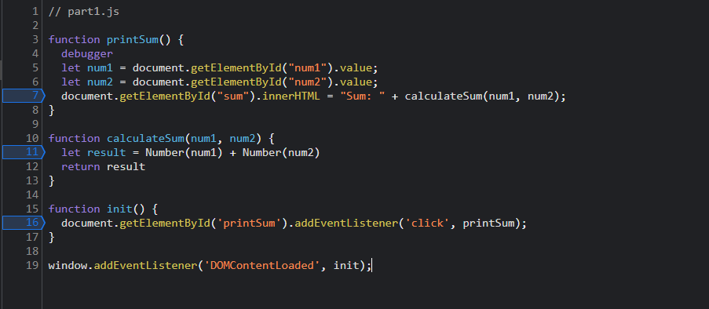

1. I input the first number as 1 and the second number as 2, it prints out the sum as 12 while the expected result should be 3. The bug here is that the two numbers are concatenated which means the type of the two numbers is a string, thus, it could not do addition as an integer.

2. In this case, I convert the num1 and num2 to integer type at line 11 such as Number(num1) + Number(num2), so that it can do the addition as integer.

